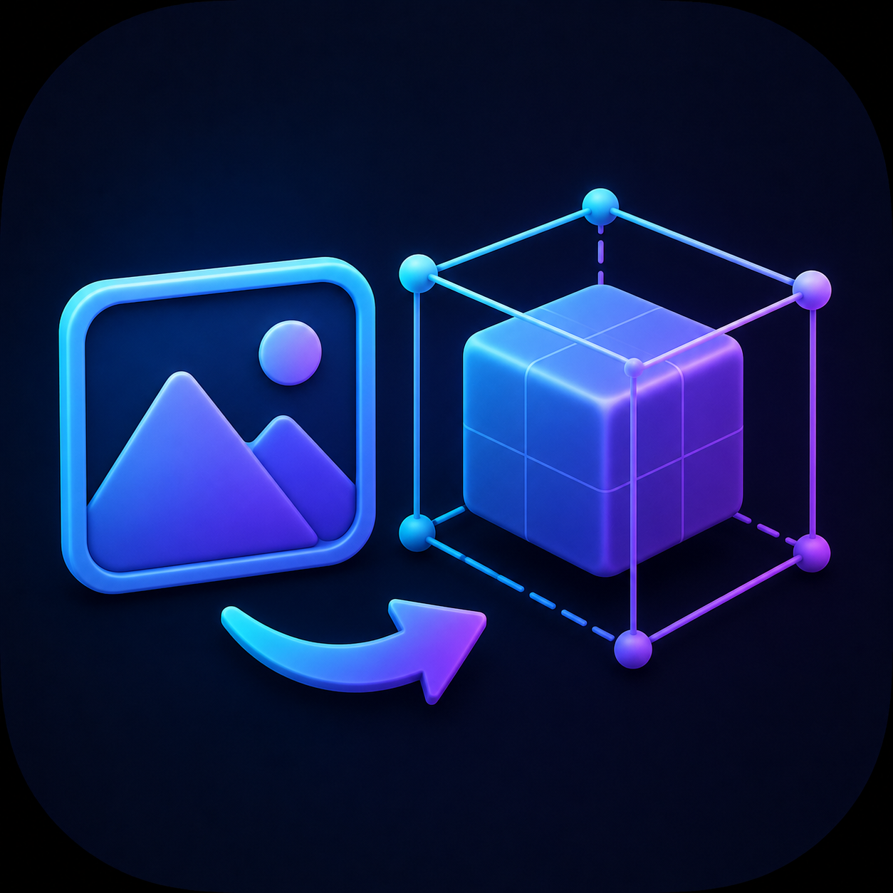
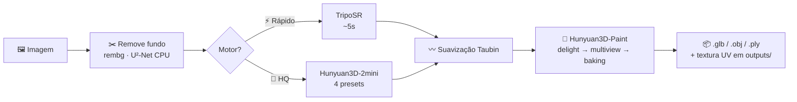

<div align="center">



# 🧊 3draza · 3D Generator PRO

### Uma imagem entra. Um modelo 3D texturizado sai. Tudo na sua GPU.
##### *One image in. A textured 3D model out. All on your own GPU.*

<br/>

[](https://3draza.vercel.app)
[](https://www.python.org/)
[](https://pytorch.org/)
[](https://www.gradio.app/)

[](https://github.com/VAST-AI-Research/TripoSR)
[](https://github.com/Tencent-Hunyuan/Hunyuan3D-2)
[](https://github.com/Tencent-Hunyuan/Hunyuan3D-2)
[](#-requisitos)
[](#)

**🇧🇷 [Português](#-português)  ·  🇺🇸 [English](#-english)  ·  🌐 [Site / Demo](https://3draza.vercel.app)**

</div>

---

## 🇧🇷 Português

> **De uma única foto a um `.glb` texturizado, sem mandar nada para a nuvem.**
> Toda a inferência roda na **sua placa de vídeo** — construído e medido numa **RTX 3050 de 4 GB**.

### 💡 O que é

**3draza** (3D Generator PRO) é um app de **desktop** que transforma **uma imagem** num **modelo 3D pronto para engine** — malha + textura UV. A interface é uma janela [Gradio](https://www.gradio.app/) local (`127.0.0.1`): você escolhe o motor, joga a imagem e recebe o `.glb`/`.obj`/`.ply`.

Gerar 3D a partir de imagem normalmente significa **serviço pago na nuvem**, upload dos seus assets e **VRAM de sobra**. O 3draza inverte isso: **offline, gratuito e cabendo em 4 GB**, graças a *CPU offload* dos modelos de difusão, decimação da malha antes do baking e *spill* automático para a RAM.

> 🌐 **Veja exemplos 3D reais, interativos, no navegador:** **[3draza.vercel.app](https://3draza.vercel.app)**

### ✨ Recursos

| | Recurso | Detalhe |
|---|---|---|
| ⚡ | **Motor rápido — TripoSR** | Reconstrução em **~5 s**. Ideal para prototipar e iterar. |
| 💎 | **Motor HQ — Hunyuan3D-2mini** | **4 presets** (Equilíbrio → Extrema) trocando *steps* / octree / chunks. |
| 🎨 | **Texturização SOTA — Hunyuan3D-Paint** | *delight → multiview → back-projection/baking*. Repinta **até os lados que a foto não mostra**, em UV de até **2048px**. |
| ✂️ | **Remoção de fundo automática** | rembg / U²-Net rodando na **CPU** (poupa VRAM). |
| 📚 | **Modo lote** | Dezenas de imagens de uma vez, tolerante a falhas, com **log + ETA** e download em **`.zip`**. |
| 🛟 | **Nunca te deixa sem resultado** | Se o Hunyuan falhar, **fallback automático** para o TripoSR. |
| 🔒 | **Local e portátil** | Cache do HuggingFace, pesos e saídas ficam **dentro da pasta do projeto** — nunca em `%APPDATA%` nem na nuvem. |
| 🪟 | **Afinado para Windows + CUDA 12.4** | Carrega as DLLs de cuDNN do PyTorch **antes** do `import torch` (mata o erro `cudnn_*64_9.dll`). |

### 🚀 Como rodar

> **Pré-requisitos:** Windows · Python **3.10/3.11** (3.13 pode quebrar dependências) · GPU **NVIDIA com CUDA** · Git.

```bat
:: 1. venv + PyTorch (CUDA 12.4) + clones do TripoSR e Hunyuan3D-2
::    + pré-download do modelo Hunyuan-2mini-turbo (~3.8 GB)
install.bat

:: 2. (opcional) reinstala o PyTorch para CUDA 12.4
INSTALAR_CUDA_12.4.bat

:: 3. sobe o app e abre o navegador em 127.0.0.1
run.bat
```

Internamente o `run.bat` chama `env\Scripts\python.exe app.py` (caminho **absoluto**, com `PYTHONNOUSERSITE=1`), que sobe o Gradio com `app.queue().launch(inbrowser=True, server_name="127.0.0.1")`.

> 🎨 **Quer textura?** A texturização precisa do **CUDA Toolkit 12.4** + o `custom_rasterizer` compilado (one-time). Rode o `INSTALAR_CUDA_12.4.bat` se ainda não tiver o toolkit. O app abre normalmente mesmo sem ele — o erro só aparece quando você pede textura.

### 🎚️ Presets de qualidade (motor Hunyuan)

Medido na RTX 3050 4 GB com `robot.png`. `octree_resolution` é a alavanca de densidade; o modelo **não-turbo** a 30–50 passos melhora a **fidelidade da forma** (o maior ganho perceptual).

| Preset | Modelo | Passos | Octree | ⏱️ Tempo | Vértices |
|---|---|:--:|:--:|:--:|--:|
| **Equilíbrio** | turbo | 5 | 256 | ~1 min | ~237k |
| **Alta** | turbo | 5 | 384 | ~1–2 min | ~538k |
| **Máxima** *(padrão)* | mini | 30 | 512 | ~4–6 min | ~982k |
| **Extrema** | mini | 50 | 512 | ~8–10 min | ~1,04M |

*Suavização **Taubin** (λ/μ — passa-banda, não encolhe o volume) mata o "quadriculado" do marching cubes: Desligado / Suave / **Forte (padrão)** / Máximo.*

### 📊 Números reais (RTX 3050 Laptop · 4 GB)

| Etapa | Resultado |
|---|---|
| ⚡ TripoSR | **~5 s** · 80k vértices / 161k faces · pico **2,49 GB** · GLB 3,2 MB |
| 💎 Hunyuan "Máxima" + Taubin Forte | ~910k–1M vértices · **~4 min** · ~5,85 GB (spill WDDM) |
| 🎨 Textura 1024px (Hunyuan) | desvio real ~44 · ~10 min em 4 GB (spill para 9–10 GB) |

> Em 4 GB, picos de 6–10 GB funcionam via *spill* para a RAM compartilhada (Windows WDDM): **mais lento, porém sem erro**. Foi a escolha consciente — *qualidade acima de velocidade*.

### 🔬 Fluxo



### 🗂️ Estrutura

```
3draza/
├── app.py                  # App Gradio: abas Imagem única / Lote / Configurações
├── texture_gen.py          # Texturização via Hunyuan3D-Paint (import preguiçoso do rasterizer CUDA)
├── install.bat             # Setup completo (venv, torch, clones, modelo)
├── INSTALAR_CUDA_12.4.bat  # Instalador elevável (UAC) do CUDA Toolkit 12.4
├── run.bat                 # Inicia o app (python.exe do venv por caminho absoluto)
├── RELATORIO.md            # Diário técnico / auditoria (v1 → v8)
├── site/                   # Landing page (Next.js) — repositório separado
├── env/                    # venv local (ignorado)
├── TripoSR/                # Clonado (VAST-AI) — motor rápido          (ignorado)
├── Hunyuan3D2/             # Clonado (Tencent) — motor HQ + Paint      (ignorado)
├── models/                 # Cache HF + pesos (vários GB)              (ignorado)
└── outputs/                # Modelos .glb/.obj/.ply gerados            (ignorado)
```

### 🎨 Como a textura funciona

`texture_gen.py` pega o mesh gerado + a imagem e **repinta** o modelo com difusão multi-view: **delight** (remove sombra/luz) → **multiview UNet** (6 vistas) → **back-projection + baking** numa textura UV (xatlas). Gera detalhe plausível **até nos lados não vistos**.

Otimizações para caber em 4 GB: `enable_model_cpu_offload()` nos sub-pipelines, `attention_slicing` + `vae.slicing`, **decimação** do mesh via pymeshlab antes do unwrap, e `_free_generator_models()` para liberar o TripoSR/Hunyuan da VRAM antes do paint.

**Exportação:** Modelo + textura (GLB embute tudo; OBJ vira `.zip` com MTL+PNG) · Somente textura (PNG do atlas) · Somente modelo (geometria pura).

### 🆘 Solução de problemas

<details>
<summary><b>Abrir notas de campo (gotchas reais, já resolvidos)</b></summary>

- **`Could not locate cudnn_*64_9.dll`** — o cuDNN 9 do PyTorch carrega plugins via `LoadLibrary`, que só olha o `PATH`. `app.py` põe `torch/lib` no `PATH` **antes** do `import torch` (`_enable_torch_cudnn_dlls`). *Não use `glob` aqui:* o caminho pode ter `[colchetes]`.
- **`No module named 'onnxruntime'` no `import rembg`** — o venv foi **movido** de pasta e o `activate.bat` tem o caminho hardcoded → cai no Python global. `run.bat` chama `env\Scripts\python.exe` por **caminho absoluto** + `PYTHONNOUSERSITE=1`.
- **rembg quebra na GPU** — `onnxruntime-gpu` exige cuDNN 9. Forçado **CPU**: `rembg.new_session("u2net", providers=["CPUExecutionProvider"])`.
- **Textura não compila** — o `custom_rasterizer` é uma extensão CUDA. O nvcc do sistema (13.x) não bate com o PyTorch (cu124) → instale o **CUDA 12.4** (use `INSTALAR_CUDA_12.4.bat`) e compile com o toolset **MSVC 14.38**.
- **Caminho com espaços/colchetes** (`[SAAS] 3draza`) — quebra as command lines do nvcc e o `glob`. Build do rasterizer numa pasta temporária sem espaços; no código, `os.walk`/`os.scandir` no lugar de `glob`.
- **Travou no primeiro uso do Hunyuan** — `HY3DGEN_MODELS` aponta para um dir local fixo + download resumível único → carga **offline**, sem lock órfão do `huggingface_hub`.

</details>

### 🧱 Por que não Hunyuan3D-2 *full* / TRELLIS?

Em 4 GB não cabem nem com *spill*: o full 1.1B (fp16 ~4,93 GB) sozinho já excede a VRAM total e arrisca **WDDM TDR** (reset de driver); TRELLIS quer ~16 GB. O **`mini` (0.6B) + octree 512 + Taubin** é o melhor custo/qualidade que roda aqui. Para o full/TRELLIS, ≥ 12 GB de VRAM.

---

## 🇺🇸 English

> **From a single photo to a textured `.glb`, without sending anything to the cloud.**
> All inference runs on **your own GPU** — built and measured on a **4 GB RTX 3050**.

### 💡 What it is

**3draza** (3D Generator PRO) is a **desktop** app that turns **one image** into an **engine-ready 3D model** — mesh + UV texture. The UI is a local [Gradio](https://www.gradio.app/) window (`127.0.0.1`): pick an engine, drop an image, get a `.glb`/`.obj`/`.ply`.

Image-to-3D usually means **paid cloud**, uploading your assets and **plenty of VRAM**. 3draza flips that: **offline, free and fitting in 4 GB**, thanks to diffusion-model *CPU offload*, mesh decimation before baking and automatic *spill* to RAM.

> 🌐 **See real, interactive 3D models in your browser:** **[3draza.vercel.app](https://3draza.vercel.app)**

### ✨ Features

| | Feature | Detail |
|---|---|---|
| ⚡ | **Fast engine — TripoSR** | Reconstruction in **~5 s**. Great for prototyping. |
| 💎 | **HQ engine — Hunyuan3D-2mini** | **4 presets** (Balanced → Extreme) trading *steps* / octree / chunks. |
| 🎨 | **SOTA texturing — Hunyuan3D-Paint** | *delight → multiview → back-projection/baking*. Repaints **even the sides the photo never showed**, in UV up to **2048px**. |
| ✂️ | **Automatic background removal** | rembg / U²-Net on the **CPU** (saves VRAM). |
| 📚 | **Batch mode** | Dozens of images at once, failure-tolerant, with **log + ETA** and a **`.zip`** download. |
| 🛟 | **Never leaves you empty-handed** | If Hunyuan fails, **automatic fallback** to TripoSR. |
| 🔒 | **Local & portable** | HuggingFace cache, weights and outputs live **inside the project folder** — never in `%APPDATA%` or the cloud. |
| 🪟 | **Tuned for Windows + CUDA 12.4** | Loads PyTorch's cuDNN DLLs **before** `import torch` (kills the `cudnn_*64_9.dll` error). |

### 🚀 How to run

> **Requirements:** Windows · Python **3.10/3.11** (3.13 may break deps) · **NVIDIA GPU with CUDA** · Git.

```bat
install.bat                :: venv + PyTorch (CUDA 12.4) + clones + ~3.8GB model
INSTALAR_CUDA_12.4.bat     :: (optional) reinstall PyTorch / CUDA 12.4 toolkit
run.bat                    :: launches the app (opens 127.0.0.1 in the browser)
```

> 🎨 **Want texture?** Texturing needs the **CUDA Toolkit 12.4** + the compiled `custom_rasterizer` (one-time). The app opens fine without it — the error only shows when you request a texture.

### 🎚️ Quality presets (Hunyuan engine)

Measured on the 4 GB RTX 3050. `octree_resolution` is the mesh-density lever; the **non-turbo** model at 30–50 steps improves **shape fidelity** (the biggest perceptual gain).

| Preset | Model | Steps | Octree | ⏱️ Time | Vertices |
|---|---|:--:|:--:|:--:|--:|
| **Balanced** | turbo | 5 | 256 | ~1 min | ~237k |
| **High** | turbo | 5 | 384 | ~1–2 min | ~538k |
| **Maximum** *(default)* | mini | 30 | 512 | ~4–6 min | ~982k |
| **Extreme** | mini | 50 | 512 | ~8–10 min | ~1.04M |

*A **Taubin** smoothing pass (λ/μ — band-pass, volume-preserving) kills marching-cubes "staircasing".*

### 📊 Real numbers (RTX 3050 Laptop · 4 GB)

| Stage | Result |
|---|---|
| ⚡ TripoSR | **~5 s** · 80k verts / 161k faces · peak **2.49 GB** · 3.2 MB GLB |
| 💎 Hunyuan "Maximum" + Taubin | ~910k–1M verts · **~4 min** · ~5.85 GB (WDDM spill) |
| 🎨 Texture 1024px (Hunyuan) | ~10 min in 4 GB (spills to 9–10 GB) |

> In 4 GB, 6–10 GB peaks work via *spill* to shared RAM (Windows WDDM): **slower, but no errors** — a conscious *quality-over-speed* choice.

### 🗂️ Structure

See the tree in the Portuguese section. `app.py` is the Gradio UI; `texture_gen.py` does texturing; `TripoSR/` + `Hunyuan3D2/` are vendored upstream engines; `site/` is the landing page (separate repo). Heavy folders (`env/`, `models/`, `outputs/`) are git-ignored.

### 🧱 Why not Hunyuan3D-2 *full* / TRELLIS?

They don't fit in 4 GB even with spill (full 1.1B fp16 ~4.93 GB alone exceeds total VRAM and risks a WDDM driver reset; TRELLIS wants ~16 GB). The **`mini` (0.6B) + octree 512 + Taubin** combo is the best quality/cost that runs here. For full/TRELLIS you'd want ≥ 12 GB.

---

<div align="center">

### 🛠️ Stack

`Python` · `PyTorch (CUDA 12.4)` · `Gradio` · [`TripoSR`](https://github.com/VAST-AI-Research/TripoSR) · [`Hunyuan3D-2`](https://github.com/Tencent-Hunyuan/Hunyuan3D-2) · `trimesh` · `rembg` · `pymeshlab` · `xatlas`

**Licenças:** o 3draza é apenas o app. O uso dos pesos segue as licenças do **TripoSR** (Stability AI / VAST-AI) e do **Hunyuan3D-2** (Tencent) — verifique cada uma antes de uso comercial.

<br/>

🌐 **[3draza.vercel.app](https://3draza.vercel.app)** · *Parte do ecossistema de projetos de **Caio**.*

</div>
