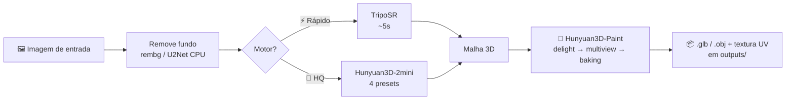

<div align="center">

# 🧊 3DRAZA — 3D Generator PRO

**De uma imagem a um modelo 3D texturizado, 100% local, na sua própria GPU.**
*From a single image to a textured 3D model — fully local, on your own GPU.*

[](https://www.python.org/)
[](https://pytorch.org/)
[](https://www.gradio.app/)
[](https://github.com/VAST-AI-Research/TripoSR)
[](https://github.com/Tencent-Hunyuan/Hunyuan3D-2)
[](#)

🇧🇷 [**Português**](#-português) · 🇺🇸 [**English**](#-english)

</div>

---

## 🇧🇷 Português
<a name="-português"></a>

### O que é

**3draza** (3D Generator PRO) é um aplicativo de desktop que transforma **uma única imagem** num **modelo 3D pronto para engine** — malha + textura UV — sem mandar nada para a nuvem. Toda a inferência roda na **sua placa de vídeo**, com cuidado especial para GPUs modestas (testado e otimizado para uma **RTX 3050 de 4 GB**).

A interface é uma janela [Gradio](https://www.gradio.app/) que abre no navegador local (`127.0.0.1`). Você escolhe o motor, joga a imagem, e recebe o `.glb`/`.obj`.

### O problema que resolve

Gerar 3D a partir de imagem normalmente exige serviços pagos na nuvem, upload de assets proprietários e VRAM de sobra. O 3draza inverte isso: **offline, gratuito e cabendo em 4 GB de VRAM**, graças a *CPU offload* dos modelos de difusão, decimação de malha antes do baking e fallback automático de marching cubes.

### Recursos

- **Dois motores de geração**, escolhidos na hora:
  - ⚡ **Rápido — TripoSR (~5s):** reconstrução veloz para prototipar.
  - 💎 **Alta qualidade — Hunyuan3D-2mini:** 4 presets (Equilíbrio, Alta, Máxima, Extrema) trocando *steps* / resolução de octree / chunks.
- 🎨 **Texturização SOTA** via **Hunyuan3D-Paint** (`texture_gen.py`): pipeline *delight → multiview → back-projection/baking* que repinta até os lados que a imagem não mostra, em UV de até 2048px.
- ✂️ **Remoção de fundo** automática (rembg / U2Net rodando em CPU).
- 📦 **Modo lote** — várias imagens de uma vez, com download em `.zip`.
- 🔒 **Tudo local e portátil:** cache do HuggingFace, modelos e saídas ficam **dentro da pasta do projeto** (`models/`, `outputs/`), nunca em `%APPDATA%`.
- 🪟 **Otimizado para Windows + CUDA 12.4:** carrega os DLLs de cuDNN do PyTorch antes do `import torch` (corrige o erro `Could not locate cudnn_*64_9.dll`).

### Como rodar

> Pré-requisitos: **Windows**, **Python 3.10/3.11** (3.13 pode quebrar dependências) e GPU **NVIDIA com CUDA**.

```bat
:: 1. Instala venv, PyTorch (CUDA 12.4), clona TripoSR + Hunyuan3D-2
::    e pré-baixa o modelo Hunyuan-2mini-turbo (~3.8 GB)
install.bat

:: 2. (opcional) reinstala o PyTorch com CUDA 12.4 se precisar
INSTALAR_CUDA_12.4.bat

:: 3. Sobe o aplicativo (abre o navegador em 127.0.0.1)
run.bat
```

Internamente o `run.bat` ativa a `env/` e roda `python app.py`, que sobe o Gradio com `app.queue().launch(inbrowser=True, server_name="127.0.0.1")`.

### Estrutura

```
3draza/
├── app.py                  # App Gradio: abas Imagem única / Lote / Configurações
├── texture_gen.py          # Texturização via Hunyuan3D-Paint (import preguiçoso do rasterizer CUDA)
├── install.bat             # Setup completo (venv, torch, clones, modelos)
├── INSTALAR_CUDA_12.4.bat  # Reinstala PyTorch p/ CUDA 12.4
├── run.bat                 # Inicia o app
├── RELATORIO.md            # Diário técnico / diagnóstico
├── env/                    # venv local (ignorado)
├── TripoSR/                # Código clonado (VAST-AI) — motor rápido
├── Hunyuan3D2/             # Código clonado (Tencent) — motor HQ + Paint
├── models/                 # Cache HF + pesos (ignorado, vários GB)
└── outputs/                # Modelos .glb/.obj gerados (ignorado)
```

### Fluxo



---

## 🇺🇸 English
<a name="-english"></a>

### What it is

**3draza** (3D Generator PRO) is a desktop app that turns **a single image** into an **engine-ready 3D model** — mesh + UV texture — without sending anything to the cloud. All inference runs on **your own GPU**, with special care for modest cards (built and tuned for a **4 GB RTX 3050**).

The UI is a local [Gradio](https://www.gradio.app/) window served at `127.0.0.1`. Pick an engine, drop an image, get a `.glb`/`.obj`.

### The problem it solves

Image-to-3D usually means paid cloud services, uploading proprietary assets, and plenty of VRAM. 3draza flips that: **offline, free, and fitting in 4 GB of VRAM**, thanks to diffusion-model *CPU offload*, mesh decimation before baking, and an automatic marching-cubes fallback.

### Features

- **Two generation engines**, switchable on the fly:
  - ⚡ **Fast — TripoSR (~5s):** quick reconstruction for prototyping.
  - 💎 **High quality — Hunyuan3D-2mini:** 4 presets (Balanced, High, Max, Extreme) trading *steps* / octree resolution / chunks.
- 🎨 **SOTA texturing** via **Hunyuan3D-Paint** (`texture_gen.py`): a *delight → multiview → back-projection/baking* pipeline that repaints even the sides the image never showed, in UV up to 2048px.
- ✂️ Automatic **background removal** (rembg / U2Net on CPU).
- 📦 **Batch mode** — many images at once, downloadable as a `.zip`.
- 🔒 **Fully local & portable:** HuggingFace cache, models and outputs live **inside the project folder** (`models/`, `outputs/`), never in `%APPDATA%`.
- 🪟 **Tuned for Windows + CUDA 12.4:** loads PyTorch's cuDNN DLLs before `import torch` (fixes the `Could not locate cudnn_*64_9.dll` error).

### How to run

> Requirements: **Windows**, **Python 3.10/3.11** (3.13 may break deps) and an **NVIDIA GPU with CUDA**.

```bat
install.bat                :: venv + PyTorch (CUDA 12.4) + clones + ~3.8GB model
INSTALAR_CUDA_12.4.bat     :: (optional) reinstall PyTorch for CUDA 12.4
run.bat                    :: launches the app (opens 127.0.0.1 in the browser)
```

### Structure

See the tree in the Portuguese section above — `app.py` is the Gradio UI, `texture_gen.py` does texturing, and `TripoSR/` + `Hunyuan3D2/` are vendored upstream engines. Heavy folders (`env/`, `models/`, `outputs/`) are git-ignored.

---

<div align="center">

*Parte do ecossistema de projetos de **Caio**.*

</div>
